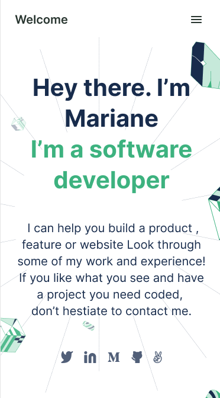

# Portfolio: setup and mobile version skeleton

> the first 3 sections of the mobile website using a template .

## Built With

- HTML
- CSS

## Live Demo

[Live Demo Link](https://jihaneh.github.io/Portfolio/)

## Getting Started

Download the project, unzip it and open index.html file in the browser

## Authors

👤 **JihaneH**

- GitHub: [@githubhandle](https://github.com/jihaneH)
- Twitter: [@twitterhandle](https://twitter.com/jijihaddad)
- LinkedIn: [LinkedIn](https://linkedin.com/in/jihane-haddad/)

## 🤝 Contributing

Contributions, issues, and feature requests are welcome!

Feel free to check the [issues page](../../issues/).

## Show your support

Give a ⭐️ if you like this project!

## 📝 License

This project is [MIT](./MIT.md) licensed.
